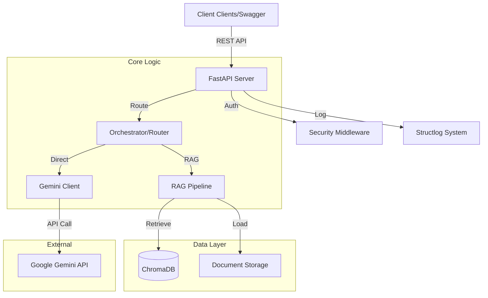

# System Architecture

## Overview
This project is a high-performance LLM Wrapper designed to demonstrate modern AI Engineering practices. It bridges the gap between raw LLM APIs (Google Gemini) and production-grade application requirements (RAG, Logging, Security).

## Component Diagram

## Key Decisions

### 1. Framework: FastAPI
- **Why**: Native Async support, high performance, automatic OpenAPI documentation.
- **Benefit**: capable of handling concurrent LLM requests efficiently.

### 2. Vector Store: ChromaDB
- **Why**: Open source, easy to run locally (embedded), no complex infrastructure setup required for portfolio.
- **Benefit**: Simplifies the "Getting Started" experience while demonstrating RAG concepts.

### 3. LLM: Google Gemini
- **Why**: Cost-effective (Free tier available), large context window, multimodal capabilities.
- **Benefit**: Accessible for development and testing without high costs.

### 4. Background Tasks
- **Why**: File ingestion can be slow.
- **Benefit**: Using FastAPI `BackgroundTasks` ensures the API remains responsive during document uploads.

## Data Flow (RAG)
1. **Ingestion**: User Uploads File -> API saves to disk -> Background Task loads content -> Embeds chunks -> Saves to ChromaDB.
2. **Retrieval**: User Query -> API Embeds Query -> ChromaDB finds similar chunks -> Prompt formulated with Context -> LLM Generates Answer.
